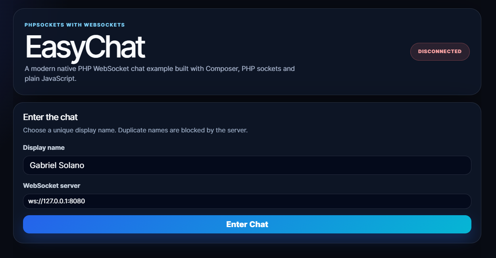
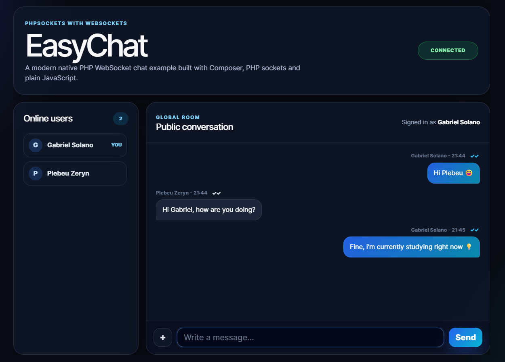
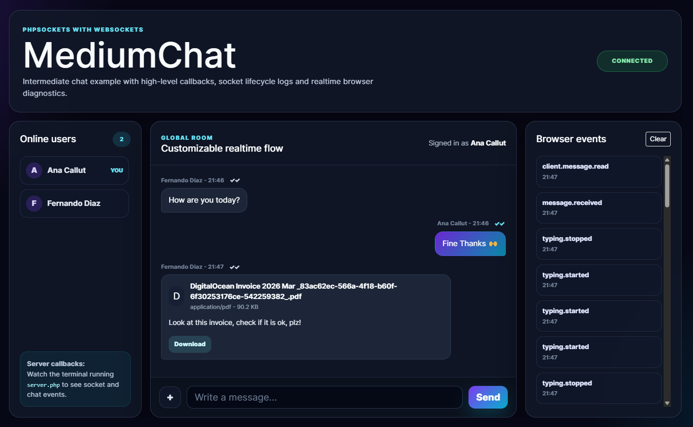
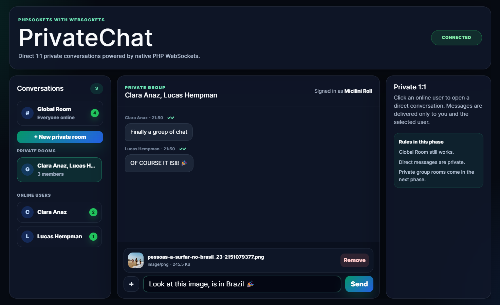

# PHPSockets

Native PHP WebSocket and realtime chat foundation built from scratch with PHP sockets. Works standalone with plain PHP or inside Laravel applications.

<p align="center">
  <a href="https://www.php.net/"></a>
  <a href="https://laravel.com/"></a>
  <a href="https://github.com/micilini/php-websockets/blob/master/LICENSE.txt"></a>
  <a href="https://github.com/micilini/php-websockets/actions"></a>
  <a href="https://packagist.org/packages/micilini/php-websockets"></a>
</p>

<p align="center">
  <strong>Pure PHP WebSockets. Realtime chat. Private rooms. Bots. Laravel-ready.</strong>
</p>

---

## Application Images

<div style="display:flex;flex-wrap:wrap;gap:10px;justify-content:center;">
  <div style="flex:1 1 220px;max-width:32%;aspect-ratio:16/9;overflow:hidden;border-radius:8px;">
    
  </div>
  <div style="flex:1 1 220px;max-width:32%;aspect-ratio:16/9;overflow:hidden;border-radius:8px;">
    
  </div>
  <div style="flex:1 1 220px;max-width:32%;aspect-ratio:16/9;overflow:hidden;border-radius:8px;">
    
  </div>
  <div style="flex:1 1 220px;max-width:32%;aspect-ratio:16/9;overflow:hidden;border-radius:8px;">
    
  </div>
</div>

---

## Overview

**PHPSockets** started in 2016 as an educational experiment demonstrating how to build a WebSocket server directly with PHP sockets, without Node.js, without socket.io, and without a third-party realtime runtime.

The project has now been rebuilt as a modern Composer package for PHP 8.2+, with a clean architecture, WebSocket protocol primitives, a realtime server runtime, a chat kit, private conversations, private group rooms, small attachments, emoji-safe payloads, bot hooks, optional storage adapters, and Laravel integration.

The goal is not only to provide a chat example.

The goal is to provide a **native PHP realtime foundation** that developers can use to build:

- realtime chat widgets;
- support chat systems;
- private rooms;
- collaborative dashboards;
- notification servers;
- internal realtime tools;
- chatbot-ready messaging flows;
- Laravel-powered realtime applications.

---

## Features

- **Native WebSocket core** — handshake, frames, opcodes, close codes, ping/pong and payload validation.
- **Pure PHP socket runtime** — no socket.io, Ratchet, ReactPHP, Swoole, Workerman or Node.js required.
- **Realtime server layer** — connection registry, lifecycle events, message dispatching and safe closing.
- **Chat Kit** — sessions, unique display names, presence, global messages, direct messages and rooms.
- **EasyChat example** — simple global chat for beginners.
- **MediumChat example** — callback/event-driven chat for customization.
- **PrivateChat example** — global room, direct 1:1 conversations, private group rooms and unread badges.
- **Private group rooms** — create a room with selected online users only.
- **Typing indicators** — user feedback for active conversations.
- **Message receipts** — simple sent/received/read states in examples.
- **Emoji support** — safe UTF-8 text payloads with a built-in emoji picker in examples.
- **Small attachments** — images, PDFs and text files up to the configured limit.
- **Downloadable file messages** — delivered attachments include a download action.
- **Fragmented text frame support** — large JSON text messages can be reassembled safely.
- **Storage adapters** — in-memory, file JSONL messages and PDO-based SQL storage.
- **Database migrations** — SQLite, MySQL and PostgreSQL schemas through the migration runner.
- **Bot hooks** — register lightweight bots that can respond in global, direct and private group contexts.
- **Laravel integration** — Service Provider, Facade, publishable config and Artisan commands.
- **Quality tooling** — PHPUnit, PHPStan, PHP CS Fixer and GitHub Actions.
- **Legacy preserved** — the original 2016 EasyChat and MediumChat implementations are kept for historical reference.

---

## Installation

Install through Composer:

```bash
composer require micilini/php-websockets
```

For local development:

```bash
git clone https://github.com/micilini/php-websockets.git
cd php-websockets
composer install
```

---

## Requirements

Required:

- PHP 8.2 or higher;
- `ext-sockets`;
- `ext-json`;
- Composer.

Optional:

- `ext-pdo` for SQL storage adapters;
- `ext-pdo_sqlite` for SQLite storage and tests;
- Laravel 10, 11, 12 or 13 for Laravel integration.

---

## Quick Start

### Standalone PHP server

Create a simple WebSocket chat server:

```php
<?php

declare(strict_types=1);

require __DIR__ . '/vendor/autoload.php';

use Micilini\PhpSockets\Chat\ChatServer;
use Micilini\PhpSockets\Config\ChatConfig;
use Micilini\PhpSockets\Config\ServerConfig;

$server = ChatServer::create(
    ServerConfig::new(
        host: '127.0.0.1',
        port: 8080,
        maxPayloadBytes: 4 * 1024 * 1024,
        enableDebugLogs: true,
    ),
    ChatConfig::new(
        maxAttachmentBytes: 2 * 1024 * 1024,
    ),
);

$server->run();
```

Run it:

```bash
php server.php
```

The WebSocket server will listen on:

```txt
ws://127.0.0.1:8080
```

---

## Running the Examples

> The example servers can be executed both from a cloned repository and from a project where the package was installed through Composer. The examples use `examples/bootstrap.php` to locate the correct Composer autoload file automatically.

Each example has two parts:

1. a WebSocket server process;
2. a browser UI served by PHP's built-in HTTP server.

### EasyChat

Start the WebSocket server:

```bash
php examples/easy-chat/server.php
```

Open another terminal and serve the UI:

```bash
php -S 127.0.0.1:8000 -t examples/easy-chat/public
```

If you installed the package inside another project with Composer, run:

```bash
php vendor/micilini/php-websockets/examples/easy-chat/server.php
php -S 127.0.0.1:8000 -t vendor/micilini/php-websockets/examples/easy-chat/public
```

Open:

```txt
http://127.0.0.1:8000
```

EasyChat demonstrates:

- global chat;
- unique display names;
- presence;
- typing indicators;
- emoji picker;
- small attachments;
- safe message rendering.

---

### MediumChat

Start the WebSocket server:

```bash
php examples/medium-chat/server.php
```

Open another terminal and serve the UI:

```bash
php -S 127.0.0.1:8001 -t examples/medium-chat/public
```

If you installed the package inside another project with Composer, run:

```bash
php vendor/micilini/php-websockets/examples/medium-chat/server.php
php -S 127.0.0.1:8001 -t vendor/micilini/php-websockets/examples/medium-chat/public
```

Open:

```txt
http://127.0.0.1:8001
```

MediumChat demonstrates everything from EasyChat plus:

- server-side callbacks;
- low-level socket events;
- chat lifecycle logs;
- event panel in the browser;
- extensibility points for custom behavior.

---

### PrivateChat

Start the WebSocket server:

```bash
php examples/private-chat/server.php
```

Open another terminal and serve the UI:

```bash
php -S 127.0.0.1:8002 -t examples/private-chat/public
```

If you installed the package inside another project with Composer, run:

```bash
php vendor/micilini/php-websockets/examples/private-chat/server.php
php -S 127.0.0.1:8002 -t vendor/micilini/php-websockets/examples/private-chat/public
```

Open:

```txt
http://127.0.0.1:8002
```

PrivateChat demonstrates:

- global room;
- direct 1:1 conversations;
- private group rooms;
- selected participants;
- unread badges;
- attachments;
- emoji picker;
- message receipts;
- bot commands.

Try the bot commands:

```txt
/help
/echo Hello PHPSockets
```

---

## Example Matrix

| Example | Global Chat | Direct 1:1 | Private Groups | Attachments | Bots | Best For |
|---|---:|---:|---:|---:|---:|---|
| EasyChat | ✅ | ❌ | ❌ | ✅ | ❌ | First contact and learning |
| MediumChat | ✅ | ❌ | ❌ | ✅ | ❌ | Events and callbacks |
| PrivateChat | ✅ | ✅ | ✅ | ✅ | ✅ | Advanced realtime chat |

---

## Laravel Integration

PHPSockets can be used inside Laravel applications through Composer package discovery.

Install the package:

```bash
composer require micilini/php-websockets
```

Publish the configuration:

```bash
php artisan vendor:publish --tag=phpsockets-config
```

Check the package status:

```bash
php artisan phpsockets:status
```

Start the WebSocket chat server from Laravel:

```bash
php artisan phpsockets:serve
```

Run SQL migrations when using a persistent storage driver:

```bash
php artisan phpsockets:migrate --driver=sqlite
```

The package registers:

- `Micilini\PhpSockets\Laravel\PhpSocketsServiceProvider`
- `Micilini\PhpSockets\Laravel\PhpSocketsFacade`
- `phpsockets:serve`
- `phpsockets:migrate`
- `phpsockets:status`

Example usage:

```php
use Micilini\PhpSockets\Laravel\PhpSocketsFacade as PhpSockets;

PhpSockets::bots();
```

Laravel is optional. The native PHP core continues to work standalone.

---

## Running PHPSockets in a Laravel Project

A Laravel app usually has two running processes:

```txt
Laravel HTTP server
  http://127.0.0.1:8000

PHPSockets WebSocket server
  ws://127.0.0.1:8080
```

Run the WebSocket server:

```bash
php artisan phpsockets:serve
```

In another terminal:

```bash
php artisan serve
```

Then your Laravel pages can connect to:

```txt
ws://127.0.0.1:8080
```

---

## Hosting the Examples Through Laravel Routes

For a Laravel demo app, you can keep PHPSockets as the engine and let Laravel serve the example screens.

Recommended local package structure while developing PHPSockets inside a Laravel app:

```txt
laravel-app/
  packages/
    micilini/
      php-websockets/
  public/
    phpsockets/
      easy/
      medium/
      private/
  routes/
    web.php
```

After installing from Packagist, the package will live under:

```txt
laravel-app/
  vendor/
    micilini/
      php-websockets/
```

The idea is:

```txt
http://127.0.0.1:8000/
  Dashboard with Easy, Medium and Private options

http://127.0.0.1:8000/easy
  EasyChat hosted by Laravel

http://127.0.0.1:8000/medium
  MediumChat hosted by Laravel

http://127.0.0.1:8000/private
  PrivateChat hosted by Laravel
```

The WebSocket server still runs in a separate process, which is the correct model for realtime applications.

---

## Configuration

After publishing the Laravel config, `config/phpsockets.php` contains:

```php
return [
    'server' => [
        'host' => env('PHPSOCKETS_HOST', '127.0.0.1'),
        'port' => (int) env('PHPSOCKETS_PORT', 8080),
        'max_payload_bytes' => (int) env('PHPSOCKETS_MAX_PAYLOAD_BYTES', 4 * 1024 * 1024),
        'tick_microseconds' => (int) env('PHPSOCKETS_TICK_MICROSECONDS', 10000),
        'connection_limit' => (int) env('PHPSOCKETS_CONNECTION_LIMIT', 100),
        'debug' => (bool) env('PHPSOCKETS_DEBUG', false),
    ],

    'chat' => [
        'max_display_name_length' => (int) env('PHPSOCKETS_MAX_DISPLAY_NAME_LENGTH', 40),
        'max_room_name_length' => (int) env('PHPSOCKETS_MAX_ROOM_NAME_LENGTH', 80),
        'max_private_group_members' => (int) env('PHPSOCKETS_MAX_PRIVATE_GROUP_MEMBERS', 20),
        'history_limit' => (int) env('PHPSOCKETS_HISTORY_LIMIT', 50),
        'max_attachment_bytes' => (int) env('PHPSOCKETS_MAX_ATTACHMENT_BYTES', 2 * 1024 * 1024),
    ],

    'storage' => [
        'driver' => env('PHPSOCKETS_STORAGE', 'memory'),
        'database' => env('PHPSOCKETS_DATABASE'),
        'dsn' => env('PHPSOCKETS_DSN'),
        'username' => env('PHPSOCKETS_DB_USERNAME'),
        'password' => env('PHPSOCKETS_DB_PASSWORD'),
    ],
];
```

Example `.env`:

```env
PHPSOCKETS_HOST=127.0.0.1
PHPSOCKETS_PORT=8080
PHPSOCKETS_MAX_PAYLOAD_BYTES=4194304
PHPSOCKETS_MAX_ATTACHMENT_BYTES=2097152
PHPSOCKETS_ATTACHMENT_DIR=.phpsockets/attachments
PHPSOCKETS_STORAGE=memory
PHPSOCKETS_DEBUG=true
```

---

## API Overview

### Main server

```php
use Micilini\PhpSockets\Chat\ChatServer;
use Micilini\PhpSockets\Config\ChatConfig;
use Micilini\PhpSockets\Config\ServerConfig;

$server = ChatServer::create(
    ServerConfig::new(host: '127.0.0.1', port: 8080),
    ChatConfig::new(),
);

$server->run();
```

### Server events

```php
$server->on('user.joined', function (array $event): void {
    // User joined the chat.
});

$server->on('user.left', function (array $event): void {
    // User left the chat.
});

$server->on('message.received', function (array $event): void {
    // A chat message was received.
});

$server->on('room.created', function (array $event): void {
    // A private room was created.
});

$server->on('bot.responded', function (array $event): void {
    // A bot generated a response.
});
```

### Available high-level events

- `user.joined`
- `user.left`
- `message.received`
- `message.sent`
- `room.created`
- `bot.responded`

### Available low-level socket events

- `open`
- `close`
- `error`

---

## Storage

PHPSockets uses in-memory storage by default. This is perfect for examples, demos and development.

Available storage options:

```txt
memory
file JSONL messages
pdo sqlite
pdo mysql
pdo pgsql
```

### SQLite migration example

```php
use Micilini\PhpSockets\Database\MigrationRunner;
use Micilini\PhpSockets\Storage\Pdo\PdoConnectionFactory;

$pdo = PdoConnectionFactory::sqlite(__DIR__ . '/storage/phpsockets.sqlite');

(new MigrationRunner($pdo))->run('sqlite');
```

### Laravel migration command

```bash
php artisan phpsockets:migrate --driver=sqlite --database=database/phpsockets.sqlite
```

---

## Attachments

The examples support small file messages.

### Attachment runtime directory

By default, PHPSockets stores temporary example attachments in a project-local directory:

```txt
.phpsockets/attachments
```

You can override this location with:

```env
PHPSOCKETS_ATTACHMENT_DIR=/absolute/path/to/attachments
```

This is especially useful for production deployments, Laravel apps, containers and Windows environments.

Supported MIME types:

```txt
image/png
image/jpeg
image/gif
application/pdf
text/plain
```

Default max file size:

```txt
2 MB
```

Attachment behavior:

- selecting a file does not send it immediately;
- the selected file appears as a pending attachment;
- the user can add a text caption;
- the file is sent only when the user clicks `Send`;
- delivered files include a download button;
- unsafe MIME types are rejected;
- files above the configured limit are rejected.

The initial transport uses JSON text-frame envelopes with base64 payloads over WebSocket. Larger uploads should use a future HTTP upload flow with WebSocket metadata messages.

---

## Bot Hooks

PHPSockets includes a lightweight bot layer.

Bots can listen to text messages and return a response in the same conversation context.

Supported contexts:

- Global Room;
- Direct conversations;
- Private group rooms.

Example:

```php
use Micilini\PhpSockets\Contracts\BotInterface;
use Micilini\PhpSockets\Chat\Bot\BotContext;
use Micilini\PhpSockets\Chat\Bot\BotResponse;

final class EchoBot implements BotInterface
{
    public function name(): string
    {
        return 'EchoBot';
    }

    public function handle(BotContext $context): ?BotResponse
    {
        $text = trim($context->text());

        if (!str_starts_with($text, '/echo ')) {
            return null;
        }

        return BotResponse::text(substr($text, 6));
    }
}
```

Register the bot:

```php
$server->bots()->register(new EchoBot());
```

Bots are intentionally simple in v1. They do not require any external AI API.

---

## Protocol Notes

PHPSockets uses JSON text frames for chat messages.

Example client message:

```json
{
  "type": "message.global",
  "payload": {
    "text": "Hello world 🚀"
  }
}
```

Example server message:

```json
{
  "type": "message.received",
  "payload": {
    "message": {
      "id": "msg_01",
      "roomId": "global",
      "fromUserId": "usr_01",
      "kind": "text",
      "body": "Hello world 🚀"
    }
  }
}
```

Binary WebSocket frames are not accepted by the chat core in this version. File messages are transported as validated JSON text-frame envelopes.

---

## Security Model

PHPSockets includes a practical safety baseline for examples and local-first applications:

- messages are rendered safely in the examples;
- user-provided text should not be rendered with unsafe `innerHTML`;
- display names are normalized and must be unique while online;
- payload size is limited;
- attachment size is limited;
- attachment MIME type is validated;
- users cannot send messages to rooms they do not belong to;
- private group messages are delivered only to room members;
- bot messages do not trigger infinite bot loops;
- malformed frames can be rejected with WebSocket close codes.

This package is a realtime foundation. Production applications should still add authentication, authorization, HTTPS/WSS, monitoring, rate limiting, persistent storage and infrastructure hardening.

---

## Project Structure

```txt
src/
  WebSocket.php
  Config/
    ServerConfig.php
    ChatConfig.php
  Protocol/
    Handshake.php
    Frame.php
    FrameCodec.php
    Opcode.php
    CloseCode.php
  Server/
    WebSocketServer.php
    ServerRuntime.php
    SocketServer.php
    Loop.php
  Connection/
    Connection.php
    ConnectionRegistry.php
  Events/
    CallbackEventDispatcher.php
    EventDispatcher.php
  Contracts/
    BotInterface.php
    SessionStoreInterface.php
    MessageStoreInterface.php
    RoomStoreInterface.php
    AttachmentStoreInterface.php
  Chat/
    ChatServer.php
    ChatKernel.php
    ChatMessage.php
    Room.php
    RoomManager.php
    PresenceManager.php
    Bot/
      BotManager.php
      BotContext.php
      BotResponse.php
  Storage/
    InMemory/
    File/
    Pdo/
  Database/
    MigrationRunner.php
    Schema/
  Laravel/
    PhpSocketsServiceProvider.php
    PhpSocketsFacade.php
    PhpSocketsManager.php
    Commands/
      ServeCommand.php
      MigrateCommand.php
      StatusCommand.php

examples/
  easy-chat/
  medium-chat/
  private-chat/

legacy/
  EasyChat/
  MediumChat/
```

---

## Testing and Quality

Install development dependencies:

```bash
composer install
```

Validate the package:

```bash
composer validate --strict
```

Run tests:

```bash
composer test
```

Run static analysis:

```bash
composer analyse
```

Check code style:

```bash
composer cs:check
```

Fix code style:

```bash
composer cs:fix
```

Run the full quality pipeline:

```bash
composer quality
```

---

## Legacy Code

The original 2016 implementation is preserved under:

```txt
legacy/EasyChat
legacy/MediumChat
legacy/README-2016.md
legacy/NOTES.md
```

The legacy code is kept for historical and educational purposes only. The modern Composer package lives in `src/` and does not depend on the old structure.

---

## Roadmap

Current v1 focus:

- native WebSocket core;
- realtime server runtime;
- chat kit;
- EasyChat, MediumChat and PrivateChat;
- private groups;
- storage adapters;
- small attachments;
- bot hooks;
- Laravel integration;
- documentation and Packagist release.

Future ideas:

- standalone CLI binary;
- WSS/TLS helper documentation;
- Redis adapter;
- multi-process scaling;
- chunked binary file transfer;
- HTTP upload + WebSocket metadata;
- JWT/auth adapters;
- Laravel dashboard;
- official Docker image;
- benchmarks.

---

## Packagist Release Checklist

Before tagging a stable release:

```bash
composer validate --strict
composer quality
```

Then:

```bash
git tag v1.0.0
git push origin v1.0.0
```

Submit the repository to Packagist:

```txt
https://packagist.org/packages/submit
```

After Packagist detects the package, users can install it with:

```bash
composer require micilini/php-websockets
```

Repository:

```txt
https://github.com/micilini/php-websockets
```

---

## License

PHPSockets is open-sourced software licensed under the [MIT license](LICENSE.txt).

---

## Credits

Created and maintained by [Micilini](https://github.com/micilini).

Originally created in 2016 and rebuilt as a modern native PHP realtime foundation in 2026.
